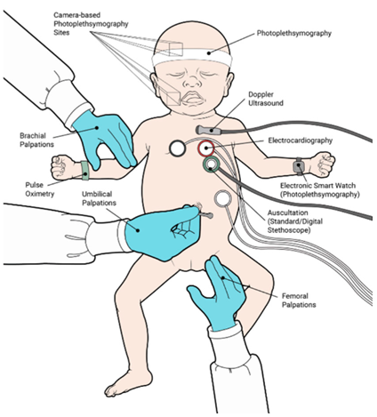
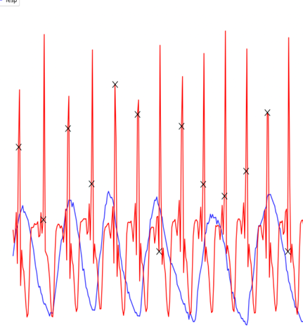

# WOA7015-Project
This is a group project for WOA7015 course of Advanced Machine Learning

## Group 7
1. Lee Wai Key (17194567)
2. Nasib Ullah (S2019652)
3. Yuhuan He (S2165922)
4. Gary Siew Wah Yee (S2190954)

## Introduction: 
Neonates (newborns) need so much care, in the initial stage specially in the first four weeks of their lives it is crucial to monitor their health parameters such as respiratory rates and heart rate, these parameters can help the doctors to determine the health of the neonates, as the heart rate of infants in the first few minutes of birth is resuscitation and it helps to diagnose the early neonatal mortality and potentially sever brain injury in those who survive, so an accurate assessment of heart rate and respiratory rate at birth is crucial in guiding further resuscitation efforts.
To monitor the heart rate and respiratory rate in these newborns the common and known methods are electrocardiography (ECG) and pulse oximetry but these methods are not appropriate for newborns as these methods typically involve attaching many devices to the neonates which are invasive and intrusive methods that need special care and experts, Although ECG is considered a more accurate way to measure heart rate, it can be problematic when applied to neonates. This is because it may cause damage to the delicate and premature skin of premature infants, and it may not be operated optimally if the clinician does not have the right experience.
In this project, we investigate the possibility of estimating heart rate directly from the respiratory signal based on the knowledge that there exists a correlation between respiration and heart in neonates. The respiratory signal can be non-invasively recorded using a simple respiratory inductive plethysmography (RIP) belt, which could reduce the invasiveness of heart rate measurements in neonates. The goal of this study is to develop a non-invasive method for measuring heart rate in neonates that utilizes the correlation between respiration and heart rate, and to evaluate the feasibility of using this method in a clinical setting.
To achieve this goal, we have collected respiratory and heart rate data from PhysioNet. The dataset covers the ECG and RESP signals of 10 different infants. using both RISP and ECG datasets We used signal processing techniques to extract features from the respiratory signal and heart rate signals, we also standardized the RISP and ECG signals for better computational efficiency. Finally, we used machine learning techniques to train and build a model that can estimate heart rate from the respiratory signal. We evaluated the performance comparing the estimated heart rate with the reference heart rate obtained from ECG.
The results of this study provided a way of predicting the accurate hear rate from the respiratory signals which is a non-invasive method for measuring heart rate in neonates that reduces the risk of skin damage in premature infants and improves the accuracy of heart rate measurements.
      

## Problem Statement
Heart and respiratory rates are crucial clinical indicators in monitoring a person’s health status, especially the neonates. The common methods of measuring heart rate in neonates are electrocardiography (ECG) and pulse oximetry, which are intrusive methods. 

## Objective
To investigate the feasibility of estimating heart rate in neonates using respiratory signals, as a non-intrusive alternative to ECG and pulse oximetry.

## Literature Review
1. Non-invasive sensor methods used in monitoring newborn babies after birth, a clinical perspective 
2. Heart Rate Monitoring in Newborn Babies: A Systematic Review
3. Wearable technology for baby monitoring: a review
4. EEG, behavioural and physiological recordings following a painful procedure in human neonates
